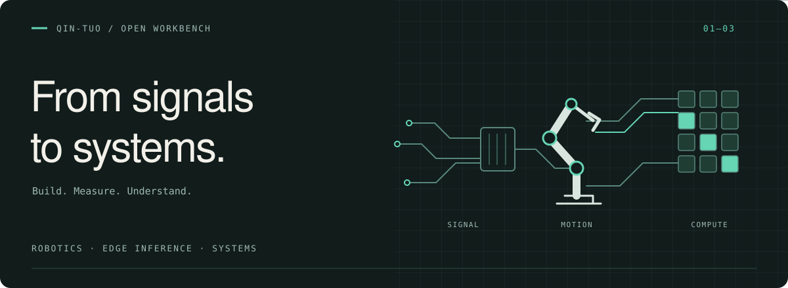

  

<h1 align="center">Hi, I'm 陈曳 / Qin-tuo 👋</h1>

  机器人软件工程师 · 喜欢折腾软硬件 
  正在探索边缘推理、异构计算与 GPU 性能优化

  
  
  

### 🛠 Tech Stack & Tools

| Domain | Stack |
| :--- | :--- |
| Languages |    |
| Robotics & Embedded |    |
| Systems & Tools |    |
| Exploring · AI Systems |     |

   
  ⚡ From signals to systems. Keep building.

